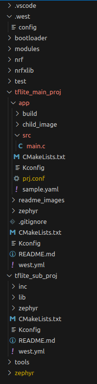
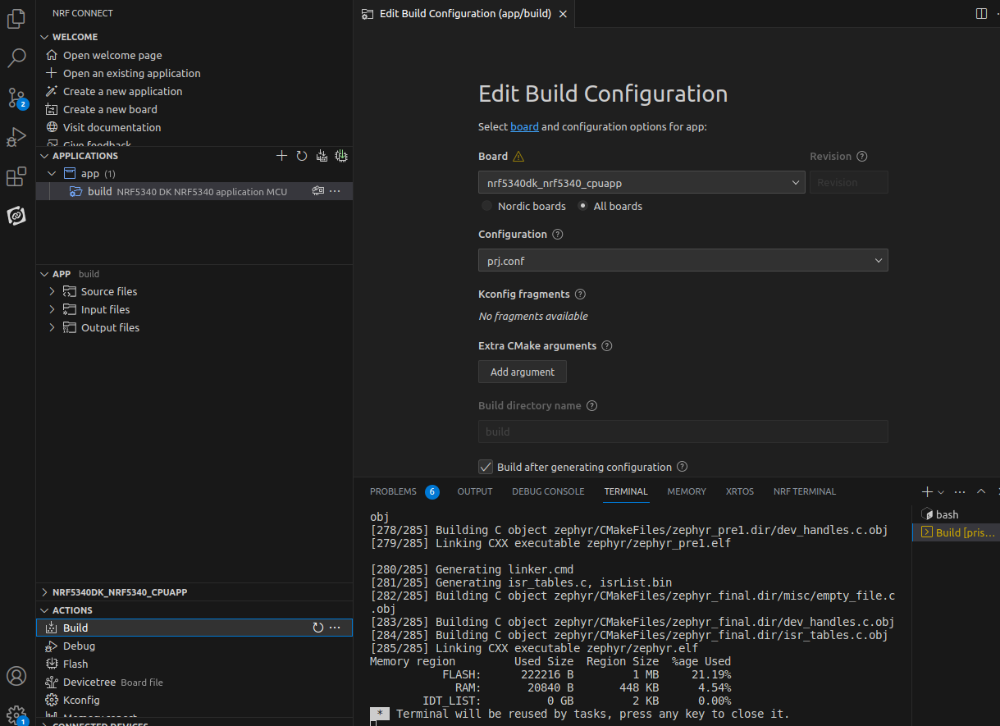

# tflite_main_proj
tflite toy zephyr project for debugging

# Setup
1. Clone this repo into a workspace directory ie "tf-ws"
2. In the workspace directory run `west init`
 - Change the path in .west/config

        ```
        [manifest]
        path = tflite_main_proj
        file = west.yml

        [zephyr]
        base = zephyr
        ```
3. Run `west update` This should download `tflite_sub_proj` as well the nrf, modules, and zephyr folders
 - What the file tree of the workspace should look like:

 


4. The app in tflite_main_proj/app can be built using the nrf vs code extension. The board we are configured for is the `nrf5340dk_nrf5340_cpuapp` though others may work as well.

 - Build configuration via tha vs code extension:
 
 
 